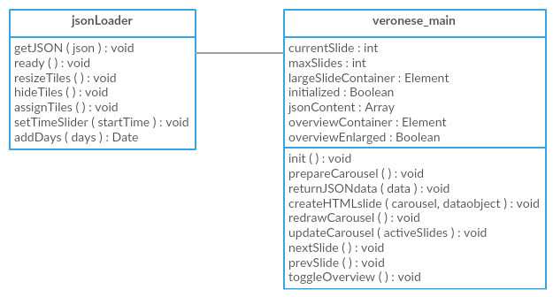

# Technische Dokumentation
Im Folgenden soll ein technischer Überblick über das Projekt gegeben werden. Dabei wird zunächst die vorliegende Dateistruktur erläutert. Sie sollte wie folgt aussehen:
```
/content
/images
/scripts
/styles
/arrowLeft.png
/arrowRight.png
/closeButton.png
/data.json
/homeButton.png
/index.html
/introvideo.mp4
/introvideo.webm
/magnificationGlass.png
/restauration.html
/startButton.png
```
Im Ordner `content` liegen die darzustellenden Informationstexte zu den jeweiligen Restaurierungsmethoden. Zugehörige Bilder sind dabei in `images` zu finden.
Unter `scripts` kann die Applikationslogik eingesehen werden. UI-Styling-Angelegenheiten befinden sich dagegen im Ordner `styles`.

Weiterhin gibt es zwei HTML-Dateien, eine für die Startseite (`index.html`) und eine für die Hauptinhalte (`restauration.html`).
Für das auf der Startseite befindliche Video werden zwei Formate genutzt.
Die Datei `data.json` dient vor allem der korrekten Zuordnung von Informationstexten und Bildern.
Die zahlreichen Bilder im PNG-Format werden für verschiedene klickbare Funktionalitäten innerhalb der Anwendung eingesetzt.

## Softwaretechnologischer Aufbau
Um eine möglichst hohe Portabilität zu verwirklichen, wird ein webbasierter Ansatz gewählt. Dadurch ist eine Ausführung auf verschiedenen Plattformen möglich.
Die Anwendung baut dabei auf den Webtechnologien HTML, CSS und JavaScript auf.

Die JavaScript-Dateien `jsonLoader.js` und `veronese_main.js` bilden beide das Herzstück der Anwendung. In ihnen ist die wesentliche Funktionalität definiert.
Die Datei `jsonLoader.js` liest hier zunächst die JSON-Datei im Hauptverzeichnis und übergibt alle benötigten Informationen (Bilder, Datum, Informationstexte) an die Datei `veronese_main.js` weiter.
Die zahlreichen Funktionen der Zeitleiste werden ebenfalls von der Datei `jsonLoader.js` realisiert.
Die Datei `veronese_main.js` hingegen ist grundlegend für die weitere Verarbeitung der erhaltenen Informationsdaten und somit für deren korrekte UI-Darstellung verantwortlich.

<p align="center">

<div align="center"><i>Ein Überblick über die zwei wesentlichen JavaScript-Dateien.</i></div>
</p>

## Quellcode-Dokumentation

### veronese_main.js

#### `var currentSlide = 3`
stores the number of the actual visible information-slide in the main area

#### `var maxSlides = 5`
how many slides are totally available? will be determined during loading of data.json though jsonLoader.js, returning data to this script

#### `var largeSlideContainer = null`
Pointer to the DOM-object, containing all slides this object is much larger than actual screen width, to allow horizontal movement

#### `var initialized = false`
data.json is loaded asychrounously, this variable indicates, if data is already cached

#### `var jsonContent = null`
the actual data, loaded from data.json trough jsonLoader.js

#### `var overviewContainer = null`
Pointer to DOM-object containing the overview images in the upper right corner

#### `var overviewEnlarged = false`
current state of the overview image, if its enlarge to full screen width or minimized to the upper corner

#### `var mouseWheelLastTime = 0.0`
stores the last time an mousewheel event was fired. Used to determine if page should flip back

#### `var horizontalMovement = 0`
as long as last mousewheel event is inside threshold, increment movement of largeContainer

#### `var timeoutHandle = null`
store reference to timeout, to clear it if next mousewheel event is inside threshold

#### `var mouseWheelTimeout = 1000`
mousewheel timeout threshold in milliseconds, after this time page flips back to default position

#### `function init()`
will be called on body onLoad draw the canvas after data is loaded and call timeline initializer afterwards

#### `function returnJSONdata(data)`
Callback function, to be called from jsonLoader.js after data.json has been read and processed
 * **Parameters:** `data` — of stuctures that contains all information about the processes, including image paths and text

#### `function prepareCarousel()`
create all elements of the application There is one large DIV, which exceeds screen space by far, to enable horizontal scrolling This largeContainer contains smaller DIV, from which everyone fits exactly screen width every of this smaller DIV has vertical scrolling too

#### `function createHTMLslide(dataobject)`
subroutine of perpareCarousel() gets called for every process/slide Creates a DIV container inside the largeContainer, which is automatically positioned (float left) right to the last one. Contains additional DIV containers for title and content, which itself is wrapped in another div to hide the scrollbar and allow invisible scrolling
 * **Parameters:** `dataobject` — array element of the global jsonContent

#### `function redrawCarousel()`
gets called every time when a new slide should be shown moves the largeContainer to appropriate position (animated by css) and sets matching overview image to active enables or disables the left and right scroll buttons

#### `function updateCarousel(activeSlides)`
Callback-function for jsonLoader.js move to the given process
 * **Parameters:** `activeSlides` — of slide-numbers, only first item will be used

#### `function nextSlide()`
Callback function for the large button on the right side update timeLine as well

#### `function prevSlide()`
Callback function for the large button on the left side update timeline as well

#### `function toggleOverview(event)`
maximize or minimize the overview image, which is located in the upper right corner if minimized. function gets called onClick on overview-Image or if clicked elsewhere while image is maximized

#### `function resetHorizontalScroll()`
after a timeout, reset the largeContainer to default Position, if no mousewheel action occured this method is called as callback from setTimeout

#### `function scrollHorizontally(e)`
Callback-function, called on mousewheel event use horizontal scroll of wheel for page flipping, tableTop like MS surface will send mousewheel event on drag of any kind
 * **Parameters:** `e` — event

 
### jsonLoader.js

#### `$.getJSON("data.json", function(json)`
reads the data from data.json and creates movable timeslider and static time bars.

#### `$(document).ready(function()`
adds touch events and callbacks for the time slider and time bars

#### `function resizeTiles()`
Callback-function, called on mousedown touchstart / mousemove touchmove events for the time slider. Checks for active slides, adjusts the opacity and the size of shown tiles.

#### `function hideTiles()`
Callback-function, called on mouseup / touchend events for the time slider. Hides all tiles.

#### `function assignTiles()`
Function to assign the positions for the time bars. Started at init.

#### `function setTimeSlider(startTime)`
Callback-function, called on mouseup / touchend events for time bars. Reads out the date from the time bar and adjusts the movable slider.
 * **Parameters:** `startTime` — in the "yyyy-mm-dd" format

#### `Date.prototype.addDays = function(days)`
Helper function to add days to a given Date-type object
 * **Parameters:** `days` — of days to add to the date


## Architektur

Prinzipiell kann die Anwendung mithilfe eines Browsers lokal ausgeführt werden, sodass kein Webserver benötigt wird.
Optional ist die Verwendung eines Webservers für die Anwendung jedoch möglich, insbesondere für den Chrome-Browser ist dies notwendig, da Chrome keine lokalen Dateien lädt. Hierfür kann beispielsweise ein reiner Apache Server ohne zusätzliche Logik aufgesetzt werden. Es gibt keine Versionseinschränkungen für den Apache-Webserver.
Die Quelldateien der Anwendung müssen anschließend auf den Webserver hochgeladen werden, sodass diese später über die jeweilige Server-URL referenziert werden können.
Mithilfe des Browsers als Client werden die Ressourcen letztlich abgerufen.

## Systemvoraussetzungen

Die Anwendung läuft im Wesentlichen ohne Probleme unter den verbreitetsten Browsern Firefox, Chrome und Edge. Im Browser Chrome sollte das Feature `Overscroll history navigation` in den Entwickler-Einstellungen, einsehbar unter `chrome://flags/`, deaktiviert werden.
Dies verhindert ein unerwünschtes Zurücknavigieren zur Startseite nach einer horizontalen Wischgeste (mehr dazu in der Bedienungsanleitung, wo es um die Interaktionsmöglichkeiten der Anwendung geht). 
Sollten andere Browser später ebenfalls Edgw-Swype Gesten unterstützen, welche ein Verlassen der Anwendung ermöglichen, sollten diese ebenfalls im jeweiligen Browser deaktiviert werden.

Des Weiteren ist für die Anwendung kein spezielles Betriebssystem notwendig.
Für die verwendeten Technologien und Frameworks müssen von der Seite des Nutzers aus keine gesonderten Installationen durchgeführt werden, da bereits alle nötigen Dateien mitgeliefert werden.
Unter anderem wird die JavaScript-Bibliothek jQuery 3.2.1, die Erweiterung jQuery UI 1.12.1 und das Plug-in jQRangeSlider in der Version 5.7.2, welches etwa für die Zeitleiste verwendet wird, eingesetzt.
Außerdem wird zusätzlich Bootstrap 3.3.7 für die UI-Gestaltung genutzt.

Für eine optimale Darstellung der Inhalte wird ein 30 bis 36 Zoll großer Tabletop empfohlen, welches das Breitbildformat 16:9 unterstützt.
Eine Full-HD-Bildschirmauflösung wird dabei vorausgesetzt. Der Browser muss in den Vollbild-Modus versetzt werden. Die Anwendung ist auch auf anderen Geräten lauffähig und kann auch mit einem Zeigegerät bedient werden, allerdings ist die User-Experience in so einem Fall eingeschränkt, da der Bildaufbau nicht unbedingt optimal ist und oder durch geringere Rechenleistung die Wiedergabe nicht flüssig erscheint.


## Bedienungsanleitung

Wird die Anwendung durch das Aufrufen der entsprechenden Webseite gestartet, dann erscheint zunächst die Startseite mit dem zugehörigen Eyecatcher-Video.
Der Nutzer kann nun auf eine beliebige Stelle im Bild klicken, sodass er zu der Hauptseite mit den wesentlichen Inhalten gelangt.
Mit dem auf der Hauptseite befindlichen Home-Symbol, welches oben zentriert lokalisiert ist, kann der Nutzer jederzeit zur Startseite zurückkehren.

Auf der Hauptseite ist überdies oben die aktuell einsehbare Restaurierungsmethode als Titel zu sehen.
Darunter befinden sich die eigentlichen Informationsinhalte zu der jeweiligen Restaurierungsmethode mit Bildern auf der linken Seite und zugehörigen Texten auf der rechten Seite.
In diesem Bereich, der durch weiße Linien oberhalb und rechts gekennzeichnet ist, ist der Nutzer in der Lage, weitere Informationen durch Scrollen zu erforschen.
Um den Bezug zum Originalbild "Die Madonna der Familie Cuccina" nicht zu verlieren, ist dieses Bild stets oben rechts als Referenz zu sehen und durch Anklicken auch vergrößerbar.
Der Zustand des Bildes passt sich dabei fortlaufend der aktuell angezeigten Restaurierungsmethode an.

Für die Navigation zu einer anderen Restaurierungsmethode gibt es mehrere Möglichkeiten.
Der Nutzer kann hier beispielsweise die an der linken und rechten Seite befindlichen Pfeile anklicken, um zur zeitlich vorhergehenden oder nachfolgenden Restaurierungsmethode zu navigieren.
Eine andere Möglichkeit wäre per horizontale Wischgesten zu den angrenzenden Methoden zu wechseln.
Um zu einer beliebigen Restaurierungsmethode zu gelangen, kann der Slider im unteren Bereich der Seite genutzt werden.
Per Drag & Drop des goldenen Sliders wird die gewünschte Restaurierungsmethode ebenfalls ausgewählt.
Auch ein einfacher Klick auf eines der unteren Elemente führt zu einem schnellen Wechsel.
Die Navigation mithilfe des Sliders bringt an dieser Stelle den Vorteil des Einsehens einer kleinen Bildvorschau zu einer Restaurierungsmethode.
Je nachdem, wo sich der Slider während des Drag & Drop-Vorgangs befindet, werden über den jeweiligen Elementen entsprechend große Vorschaubilder angezeigt.

## Versionsverwaltung

### Commit, auf dem diese Doku basiert

8e0264afddf4206574b35711aa72ecd25a1641d9
Stand vom 22.08.2017, Master-Branch. 
Weitere Branches existieren nicht, da für diese Entwicklung ein gemeinsamer Branch wesentlich effizienter war.


### Verwendete Entwicklungsumgebung

Die Anwendung wurde vollständig in Notepad++ geschrieben. Debugging und Anpassungen erfolgten über die Entwickler-Tools von Chrome. Es kann jede beliebige IDE zur Entwicklung eingesetzt werden, welche HTML, CSS und JS unterstützt.